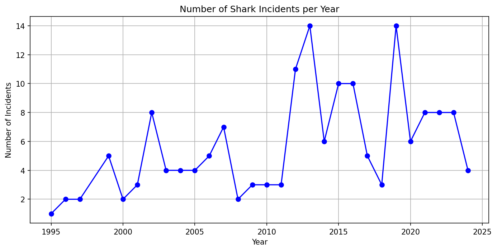
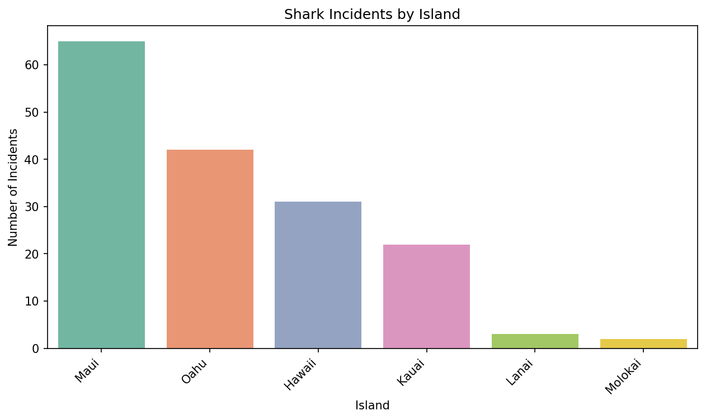
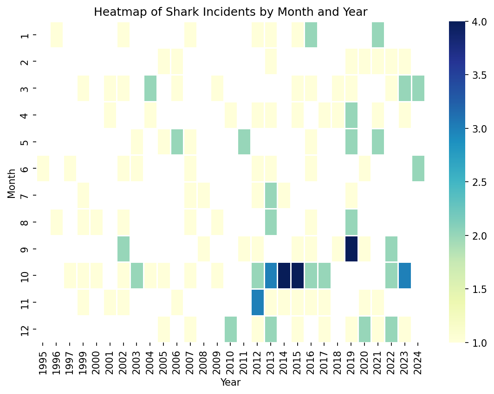

# 🏝️ Hawaii Shark Incident Data Analysis 🦈

## Overview 
This project involves the analysis of shark incident data from Hawaii, focusing on encounters where sharks actually bit a person or board. The dataset, sourced from the Hawaii Department of Land and Natural Resources, excludes cases of mere grazing and incidents classified as boat attacks or scavenging. The analysis aims to identify patterns and trends in these incidents to inform public safety measures.

## Data 📊
The data includes details such as the date, location, activity during the incident, water clarity, water depth, victim information, description of the incident, and shark species involved. The data has been cleaned, standardized, and transformed for analysis.

## Project Structure 
- **data/**: Contains raw and cleaned data files.
- **images/**: Directory for storing generated plots and visualizations.
- **Jupyter Notebook**: Python scripts for data collection, processing, and visualization.
- **README.md**: Project documentation.

## Analysis 
The analysis consists of several steps:
- **Data Collection**: Web scraping of shark incident data from the Hawaii Department of Land and Natural Resources website.
- **Data Cleaning**: Parsing dates, handling missing values, and normalizing text.
- **Data Transformation**: Converting measurements to standard units and categorizing activities.
- **Data Visualization**: Creating charts and heatmaps to visualize trends and insights.

## Key Findings 📈
### 1. Incidents Over Time
There were notable upticks in shark incidents in the years **2013 and 2019**, suggesting periodic increases in shark activity or human encounters.



### 2. Distribution of Incidents by Activity
**Surfing** and **swimming** were the activities most frequently associated with shark incidents, indicating a higher risk for participants.


### 3. Distribution of Injury Severities
Approximately **5.5%** of the shark incidents were **fatal**, highlighting the potential severity of these encounters.


### 4. Shark Species Involvement
Most incidents were associated with **Tiger Sharks**, emphasizing the need for targeted awareness and safety measures regarding this species.


### 5. Geographic Distribution
The island of **Maui** experienced the highest frequency of incidents, suggesting a possible hotspot for shark activity.



### 6. Heatmap of Shark Incidents by Month and Year
**October** had the highest frequency of shark incidents, followed by **September**, suggesting a seasonal pattern in shark encounters.



## Installation
To view and run the analysis, clone the repository and use Jupyter Notebook:

1. **Clone the repository**:
    ```sh
    git clone https://github.com/mohan-y/hawaii-shark-incident-data-analysis.git
    cd hawaii-shark-incident-data-analysis
    ```

2. **Install dependencies**:
    ```sh
    pip install -r requirements.txt
    ```

3. **Run Jupyter notebook**:
    ```sh
    jupyter notebook
    ```
## Acknowledgments
This project uses data from the [Hawaii Department of Land and Natural Resources](https://dlnr.hawaii.gov/sharks/shark-incidents/incidents-list/). The analysis and insights are aimed at contributing to public awareness and safety regarding shark incidents.

